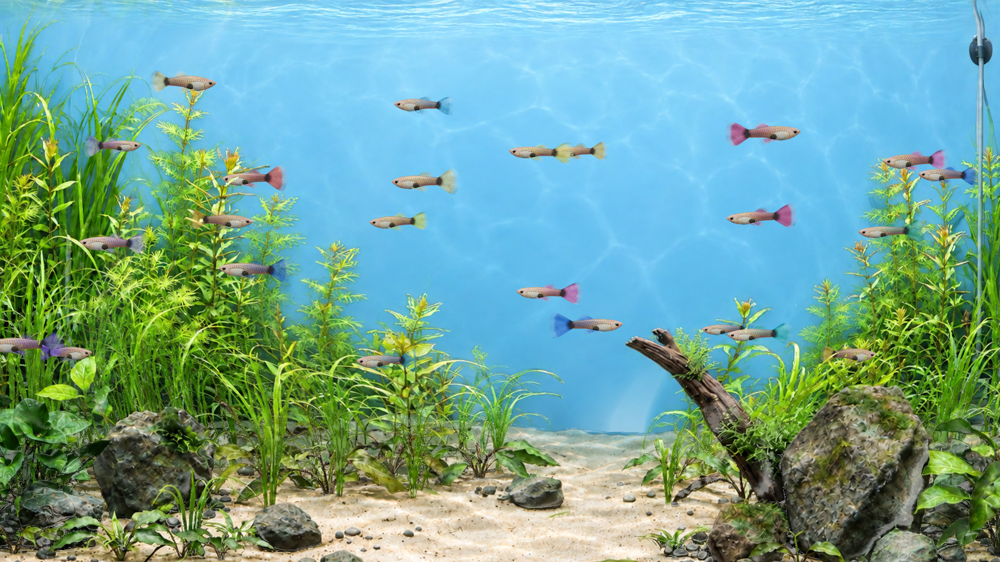

# Guppy Garden — Mac / Windows のグッピー水槽

Macの専用アプリと、WindowsのLively Wallpaperで泳ぐ24匹・8色のグッピー水槽です。Chase Lean氏のDeskworldsを固定版で利用し、魚の形・鱗・腹・ヒレ・色、水景、軽量化を調整しました。公開リポジトリなので、招待やGitHubへのログインなしで閲覧・取得できます。

**採用版は `bronze-gradient-guppy-v29-r16`、Balanced・上限24コマ/秒です。** 見た目はr14を保持し、r15で形状・影・隠れた画面のメモリを軽量化、r16で30→24コマへ変更しました。写真との完全一致や全実機項目の合格は宣言していません。




## このリンクをClaude Code・Codexへ渡す場合

**[START-HERE.md](START-HERE.md) がセットアップの入口です。** OS判定、必要な道具、取得、導入、実画面での確認、元へ戻す手順まで記載しています。対象PCのClaude Code・Codexにこのリンクを渡し、「このPCにセットアップして」と依頼してください。

| 環境 | 入口 | 動かす仕組み |
|---|---|---|
| Mac（主対応） | [Macの手順](docs/MACOS.md)、python3 setup.py install | Swift / WKWebViewの専用アプリ |
| Windows（補足対応） | [Windowsの手順](docs/WINDOWS.md)、py -3 setup.py install | 無料のLively Wallpaper |

まず setup.py doctor で環境を確認します。Windows用ZIPは setup.py build --platform windows で生成でき、PythonやNode.jsを常駐させずにLivelyで再生できます。対応OS・自動検査・実機の確認範囲は [PLATFORM-STATUS.md](docs/PLATFORM-STATUS.md) に分けて記録しています。

Windowsのビルド済み壁紙ZIPは [配布版](https://github.com/ryoga-atelier/2026-09-28-deskworlds/releases/tag/v29-r16-portable.2) から取得できます。Macはこのリポジトリのセットアップで、そのMacのCPUに合わせてビルドします。

## 元の情報と調整の経緯

- 発端のX投稿: <https://x.com/chaseleantj/status/2100663203076128908>
- 作者のソース: <https://github.com/chaseleantj/deskworlds>
- 固定コミット: `3950c45ef5798ed2df9f78037994bcddacebbb01`
- 本人指定の実魚写真: <https://www.petballoon.net/data/petballoon3/product/zc22-91018981_2.jpg>
- 写真の商品ページ: <https://www.petballoon.net/product/65143>
- [このセッションの変更履歴](SESSION-HISTORY.md) / [写真の観察点・出典・ライセンス](SOURCES-AND-LICENSES.md)

元写真は観察・比較用です。魚のテクスチャに転用していません。体は3D、植栽と背景は2.5Dで、実写と同じ光学表現や厳密な品種再現には限界があります。

## Macへ導入する（詳しくはOS別手順）

macOS 13以上、Xcode Command Line Tools（`swiftc`・`git`）、Python 3.10以上、検査用Node.js 22以上が必要です。起動後の水槽はネット接続やNode.jsを必要としません。

```sh
git clone --recurse-submodules https://github.com/ryoga-atelier/2026-09-28-deskworlds.git
cd 2026-09-28-deskworlds
# 既にclone済みであれば次で固定版の原本を取得
git submodule update --init --recursive
# インストールせずビルドだけ確認
python3 scripts/provision.py build
# ビルド・既存アプリの保存退避・導入・ログイン時起動登録
python3 scripts/provision.py install
```

導入先は `~/Applications/Deskworlds.app`、自動起動は `com.chaselean.deskworlds`。既存物は `rollback/` に保存します。元の壁紙とmacOS全体のアクセシビリティ設定は変更しません。上流のinstall/uninstallスクリプトは直接使いません。

## 普段の操作・元へ戻す

- 起動: `~/Applications/Deskworlds.app` を開く。通常はログイン時に起動します。
- 餌: メニューバーのDeskworlds → **Feed**。
- 停止・再開: **Pause / Resume**。
- 終了: **Quit**。元の壁紙が現れます。
- Macでは、水槽の約85%以上がウィンドウに隠れると水槽の画像を残して描画を止めます。見える部分が15〜40%なら12コマ/秒、それ以上ならBalanced・最大24コマ/秒で動きます。動かない場合は一時停止・低電力モード・画面ロックを確認してください。ほぼ隠れた状態またはスリープ／ロックが60秒続いたら、水槽の静止画を残してページのメモリを解放します。復帰後は描画完了まで静止画を保持します。[現在の停止・表示保持の記録](docs/COVERED-PAUSE-VERIFICATION.md) と、基盤になった [表示保持の記録](docs/RETAINED-FRAME-VERIFICATION.md) を参照してください。

```sh
# アプリを残して自動起動を解除
python3 scripts/provision.py disable-autostart
# アプリと自動起動設定を削除せず退避
python3 scripts/provision.py retire
# 作者の元の魚・水槽へ戻す
python3 scripts/provision.py install --variant original
# 今回のグッピーへ戻す
python3 scripts/provision.py install --variant guppy-v29
```

## 負荷と確認状況

現行の省負荷設定を2026-09-30に実測しました。ブラウザの裏で両画面が停止し、描画ページを解放した状態では、水槽関係のCPUは全18コア換算で約0.01%、メモリは約91MB（36GBの約0.25%、共有分の重複未除去）でした。GPU全体の平均は水槽なし13.2%、あり19.0%でしたが、他アプリも変動するため、この差をGuppy単独の使用率とは断定できません。[導入前相当／導入後の比較・測定条件・生データ](docs/CURRENT-RESOURCE-USAGE.md)にまとめています。泳いでいる時の負荷とは分けて読んでください。

現在は負荷を抑える本人の希望で、水槽がほぼ隠れたら描画を停止する設定です。以下は背後でも描画していた時の比較であり、現在の停止時の負荷ではありません。2026-09-30の比較測定時の「背後でも24コマ/秒」では、両画面を覆った状態でCPU平均23.25%（1コア換算）、GPU中央値40%（Mac全体）、描画用＋ページ用メモリ900.8MiBでした。同じ配置で直前の12コマ版はCPU11.31%、GPU32%、メモリ914.3MiB。両画面とも約24fpsを維持しています。各約90秒を1回ずつ測った比較で、GPUは他アプリを含み、メモリは共有分の重複を除いていません。[測定条件・生データ・限界](docs/BACKGROUND-SWIMMING-VERIFICATION.md) を参照してください。

以下は2026-09-29の同じMacで測定した過去の値です。被覆中に停止・ページ解放していた当時の測定で、現在の設定の負荷を示す値ではありません。通常時は外部画面だけが見え、本体画面はウィンドウに覆われています。CPUの100%は1コア分、メモリはGPU用とページ用プロセスの物理フットプリントの合計で、共有分の重複は除いていません。

| 条件 | CPU | 描画用＋ページ用メモリ | 描画速度 |
|---|---:|---:|---:|
| r14・通常 | 15.4% | 1031 MiB | 約30fps |
| r15・通常 | 15.3% | 586 MiB | 約30fps |
| r16・通常（当時の停止・解放設定） | 11.1% | 577 MiB | 24fps |
| r15・両画面の解放後 | 0.24% | 26 MiB | 0fps |

r16はr15からCPUが約27%低下。メモリはほぼ同じです。GPUは機械全体の値で、r15→r16の測定差は揺れが大きく、低下を確定できません。CPU 10%以下・メモリ450MiB以下の当初目標は未達ですが、本人は普段の操作に支障がなければ現状を受け入れる方針です。

描画、隠れた画面の解放と再表示、登録状態、既存のソース検査は確認済み。メニューのFeed/Pause/Resume/Quit、Dock、ドラッグの実操作、実スリープ復帰・再ログインは未確認が残ります。過去の「外部モニター停止」は誤記で、覆われた本体画面の停止でした。

詳細は [実測記録](V29-R15-VERIFICATION.md)、[残る確認手順](SETUP-VERIFICATION.md)、[魚の22項目点検](GUPPY-CHECKLIST-V29-R14.md)。各版の記録は当時の状態であり、現在の合否へ読み替えないでください。

## 比較画面と検査を復元する

105個の過去プレビューを、内容が同じファイルを一度だけ保存する方式で収録しています。復元時にSHA-256を照合し、既存のフォルダは上書きしません。

```sh
python3 scripts/restore-preview.py --list
python3 scripts/restore-preview.py bronze-gradient-guppy-v29-r16
cd preview/bronze-gradient-guppy-v29-r16
npm run check
npm test
cd ../..
node scripts/check-photo-guppy-v29.mjs preview/bronze-gradient-guppy-v29-r16
node scripts/check-photo-guppy-v28.mjs preview/bronze-gradient-guppy-v29-r16
node scripts/check-guppy-v17.mjs preview/bronze-gradient-guppy-v29-r16
node scripts/check-v17.mjs preview/bronze-gradient-guppy-v29-r16
node scripts/check-living-water.mjs preview/bronze-gradient-guppy-v29-r16
```

r14/r15比較ページに必要な3版を復元します（r16の外見はr15と同じ）。

```sh
python3 scripts/restore-preview.py bronze-gradient-guppy-v29-r14
python3 scripts/restore-preview.py bronze-gradient-guppy-v29-r15
python3 scripts/restore-preview.py clearwater-guppy-v18-r8
python3 scripts/review-server.py --port 8789
```

<http://127.0.0.1:8789/review/shape-v29-r15.html> を開きます。`restore-preview.py all` は全版を復元し、約4GB使います。歴史的な結果ページにはローカルだけに残した動画等へのリンクもあります。

## 保存内容

- `custom/`: 現行版と旧版の追加ソース・生成素材・生成指示と由来。
- `scripts/`: 削除を伴わない導入、診断、検査、比較復元。
- `upstream/`: 改変していない作者の固定版2件（Git submodule）。
- `history/`: 105版の比較用ソース、初期の変更前ソース、ビルド時Swift、証拠の収録一覧。
- `review/` と `evidence/`: 比較ページ、写真、代表画像、実測JSON、検査結果。

アプリ本体の大量の退避コピー、再生成できるビルド、全動画、他アプリが写り得る画面画像、常時ログはMacに残しています。含めた証拠とローカルのみの証拠は `history/evidence-inventory.json` に区別して記録しました。これは会話の逐語録ではなく、成果物と経緯のアーカイブです。
